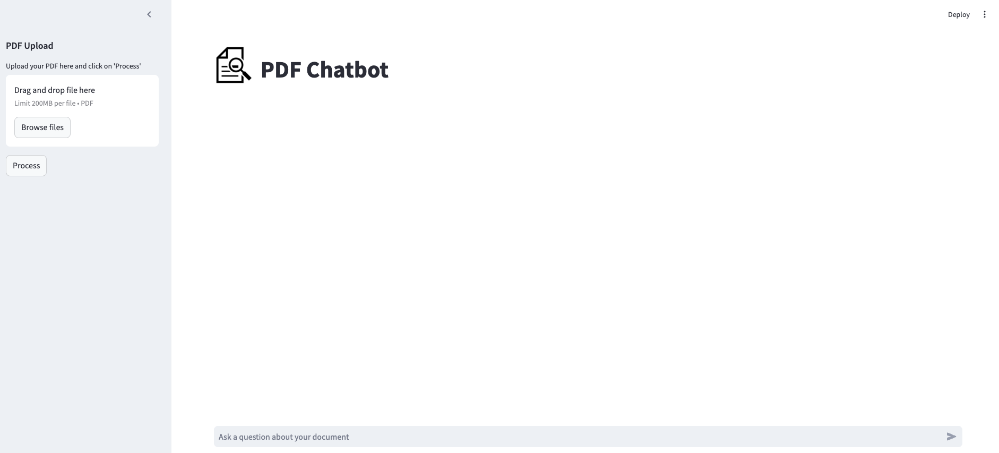

# pdf-interaction-ai

A PDF Chatbot built using ChatGroq, Llama3 and Streamlit that answers questions about an uploaded PDF. This application can be run locally and safely used with internal documents. The application relies on a conversation chain where the chat history is used to generate responses, in addition to the actual content from the document (via the vector store).

Before a file is loaded, the application looks like this in the browser window:


When a file has been uploaded, but the document has not been processed, the application looks like this:


When a file has been processed (i.e., the PDF text has been extracted, split into chunks and the embeddings stored in the vector database):


When a question has been asked, this is what ther response looks like in the application:


## Project Structure
The main application is in main.py. The functions to process the uploaded file and create the chain are in utils.py. When the application is run, a new subdirectory will be created called 'faiss_db', which will create a persistent vectorstore.

## Future enhancements
This application could be updated to allow multiple documents to be uploaded. The user will then be free to ask questions and the application will use the information from the most relevant source. The metadata from the documents can be used a filter during the RAG process to identify the most relevant and trustworthy information.

## How to run:
1. Install virtualenv:
```
$ pip install virtualenv
```

2. Open a terminal in the project root directory and run:
```
$ virtualenv venv
```

3. Then run the command to activate the virtual environment:

Windows
```
$ .\venv\Scripts\activate
```

MacOS/Unix
```
$ source venv/bin/activate
```

4. Install the dependencies:
```
$ (venv) pip install -r requirements.txt
```

5. After the dependencies have been installed, run the following:
```
$ (venv) streamlit run main.py
```

   
6. Navigate to http://127.0.0.1:7860 in a browser window to use the application outside of the Jupyter notebook.